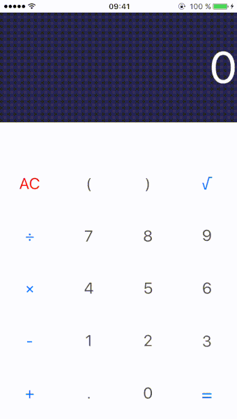

# Calcoolator

An easy-to-use handheld calculator for iOS.

## Motivation and features

Calcoolator incorporates various functionality of a hand held calculator. It prompts the user to input an expression, and displays the result of the expression inside a label. My intention was to create a very simple, easy to use, and bug-free calculator. 

The **supported set of operations** are the following:
######• square root
######• division
######• multiplication 
######• subtraction
######• addition

Additionally, Calcoolator **takes into account the order of operation**. The user can therefore input a complex expression using parentheses and copy the result to its clipboard.

Finally, before returning a result, our algorithm checks whether the the **parentheses are balanced**.

## UI Design and User Experience

The design of the hand held calculator app available on the iPhone inspired me in the process of setting up my view. I wanted to create a simpler view with more white spaces in order to make a more usable interface.
In order to create my interface, I decided to use create a nested **UIStackView**. 

## Implementation

I decided to stick to the basic Model-View-Controller (MVC) of the iOS SDK, and store all of my functions inside the ViewController.h/m files.

######• User input
In order to perform the various computations, the keys pressed by the user are appended in a string called ToEvaluate. All the buttons inside the interface have tags associated to them in order to determine which keys are being pressed.

######• Processing user input (the implementation of [stackForExpression.h](example))
Before computing the result, the *checkIfParenthesisBalanced* is invoked. In the latter, my algorithm initializes a stack of characters in order to determine if the parentheses ordering is correct and returns an error if not.
Additionally, inside the ButtonPressed IBAction, I used a switch statement for every key that is being pressed in order to integrate operations that are usually being omitted (i.e. *3(2)* will be interpretated as *3*(2)*).

######• Calculating the result
The **NSExpression** was used in order to compute the final result. 
I surrounded the *expressionValueWithObject* with a try-catch block in order to prevent any unusual exceptions to be thrown in case of a wrong input.

######• Displaying the result
I decided to implement a cocoa class for the label that displays the result. [ResultLabel.h](classDescription) is inherited from the UILabel class. It allows the user to copy the computed value to its clipboard in order to use it somewhere else on the device.

## Problems encountered 

The division operation is definitely the weakest one of Calcoolator: the NSExpression's method *expressionValueWithObject* performs an integer division **unless a float is passed to it**. Therefore, I decided to create a BOOL property that would determine whether or not the input is a decimal number or not.If this boolean is set to false, I simply append a decimal point to it in order to force a floating point division.
Ideally, I would have implemented a stack of numbers in order to keep track of every number that is used for the computation and pop the last element in it before computing the division.

## Upcoming features

Some operations I am planning on adding in the future are:
######• Trigonometric expressions (**sine**,**cosine**,**tangent**,...)
######• Exponents 
######• Logs
